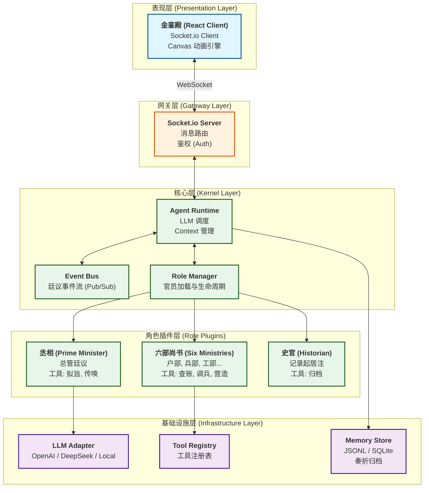

# 天命系统 (Mandate of Heaven) 架构设计文档 v1.0

## 1. 架构愿景 (Architecture Vision)

本系统旨在构建一个**沉浸式、高可扩展的“朝堂”AI 交互平台**。
我们将 OpenClaw 的先进设计理念（Agent 分层、异步协作、工具插件化）与中国古代官僚体系的业务逻辑深度融合，打造一个既有历史厚重感，又具现代 AI 智能的“赛博朝廷”。

### 核心设计原则
1.  **微内核 (Micro-Kernel)**: 保持核心运行时轻量、稳定，所有业务逻辑下沉至“官员”插件。
2.  **角色即服务 (Role as a Service)**: 每个官员（Agent）都是一个独立的微服务/插件，拥有独立的设定、记忆和工具集。
3.  **事件驱动 (Event-Driven)**: 朝堂之上的所有交互（上奏、廷议、颁旨）均通过事件总线流转，实现松耦合。
4.  **数据主权 (Data Sovereignty)**: 所有的奏折（Chat History）、圣旨（Tasks）和国库数据（Context）均本地化存储，确保隐私安全。

---

## 2. 系统分层架构 (Layered Architecture)

系统自上而下分为四层：表现层、网关层、核心层、基础设施层。



---

## 3. 核心模块详解

### 3.1 核心运行时 (Agent Runtime)
**位置**: `server/runtime/`
**职责**:
- **Agent 宿主**: 为每个官员提供运行环境（Context, Tools）。
- **LLM 调度**: 统一管理 Token 消耗，实现自动压缩（Compaction）和上下文裁剪。
- **异常处理**: 捕获 Agent 的幻觉或工具调用错误，并进行自动重试。

### 3.2 角色管理器 (Role Manager)
**位置**: `server/runtime/roles/`
**职责**:
- **动态加载**: 从配置文件 (`config/officials.json`) 或插件目录动态加载官员。
- **生命周期**: 管理官员的“上朝”（Init）、“待命”（Idle）、“奏对”（Working）状态。
- **身份隔离**: 确保户部尚书不能调用兵部的工具。

### 3.3 事件总线 (Event Bus)
**位置**: `server/runtime/events.ts`
**核心事件**:
- `AUDIENCE_START`: 上朝开始。
- `MEMORIAL_SUBMIT`: 呈递奏折（用户输入）。
- `DECREE_DRAFT`: 拟定圣旨（丞相输出）。
- `OFFICIAL_SUMMON`: 传唤官员（触发动画）。
- `OFFICIAL_REPORT`: 官员复命。

### 3.4 记忆系统 (Memory System)
**位置**: `server/runtime/memory/`
**设计**:
- **短期记忆 (Working Memory)**: 当前朝会（Session）的上下文，存储在内存中。
- **长期记忆 (Long-term Memory)**: 历史奏折、已颁布的圣旨，存储在 `data/history.jsonl` 或 SQLite 中。
- **知识库 (Knowledge Base)**: `data/laws.md` (大明律), `data/finance.csv` (国库账目)，供 RAG 使用。

---

## 4. 目录结构规范

为了保证可维护性，我们将重构项目目录如下：

```text
天命系统/
├── .env                    # 环境变量 (API Keys)
├── server/
│   ├── index.js            # 入口文件
│   └── runtime/            # 核心运行时
│       ├── Kernel.ts       # 微内核
│       ├── EventBus.ts     # 事件总线
│       ├── Memory.ts       # 记忆管理
│       ├── LLM.ts          # LLM 适配器
│       └── roles/          # 官员插件 (核心业务逻辑)
│           ├── BaseRole.ts # 角色基类
│           ├── Minister.ts # 丞相
│           ├── Historian.ts# 史官
│           └── ministries/ # 六部
│               ├── Revenue.ts
│               └── War.ts
├── data/                   # 持久化数据
│   ├── history.jsonl       # 历史记录
│   └── officials.json      # 官员配置
└── src/                    # 前端代码 (React)
    └── services/           # 前端服务
        └── SocketClient.ts # 与后端通信
```

---

## 5. 扩展性设计 (Extensibility)

### 5.1 如何添加一个新官员（如“钦天监”）？
1.  在 `server/runtime/roles/` 下创建 `Astronomer.ts`。
2.  继承 `BaseRole`，定义其 `SYSTEM_PROMPT`（负责观星、预测）。
3.  在 `data/officials.json` 中注册该角色。
4.  **无需修改核心代码**，系统启动时会自动加载。

### 5.2 如何接入新的 LLM（如本地 Ollama）？
1.  修改 `.env` 中的 `OPENAI_BASE_URL` 和 `OPENAI_MODEL`。
2.  `LLM.ts` 适配器会自动处理 API 差异。

### 5.3 如何增加新的交互形式（如“语音上朝”）？
1.  在前端接入语音转文字 (STT) 模块。
2.  通过 Socket 发送标准的 `MEMORIAL_SUBMIT` 事件。
3.  后端无需感知输入是语音还是文本，逻辑完全复用。

---

## 6. 废弃与迁移计划

### 6.1 废弃文档
以下文档已过时，建议删除或归档：
- `openclaw/docs/learning/*` (作为参考资料保留，但不作为本项目文档)
- `.trae/documents/architecture_decision.md` (已合并至本文档)
- `.trae/documents/custom_backend_plan.md` (已合并)

### 6.2 迁移步骤
1.  **Phase 1**: 搭建 `server/runtime` 骨架，实现 `Kernel` 和 `EventBus`。
2.  **Phase 2**: 将现有的 `Minister.js` 等迁移为 `BaseRole` 的子类。
3.  **Phase 3**: 建立 `Memory` 系统，接管会话历史。
4.  **Phase 4**: 清理旧代码，完成目录重构。

---

*文档版本: v1.0 | 最后更新: 2026-03-12*
