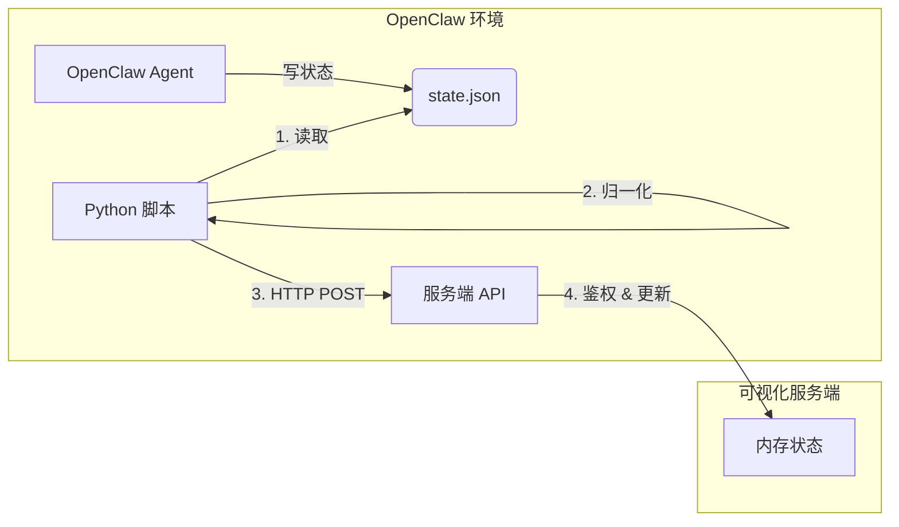

# 竞品 OpenClaw 连接机制深度解析

## 1. 核心连接模式：Client-Push (客户端主动推送)
竞品采用的是一种**“胖客户端 (Fat Client)”**模式，核心逻辑全部封装在部署于 OpenClaw 侧的 Python 脚本 (`office-agent-push.py`) 中。

### 流程图解

## 2. 关键技术细节

### 2.1 多源状态探测 (Multi-Source Detection)
竞品的 Python 脚本不只依赖单一文件，而是有一套**探测策略**：
1.  **优先**: 读取 `state.json` 文件（最实时）。
2.  **备选**: 请求本地 `http://127.0.0.1:18791/status` 接口（OpenClaw 标准 API）。
3.  **兜底**: 默认为 `idle`。

### 2.2 客户端状态清洗 (Client-Side Normalization)
**这是竞品最聪明的地方**。它不把原始的、杂乱的状态发给服务端，而是在本地就进行**归一化**：
*   `writing`, `busy`, `exec` -> 统一转为 `writing`
*   `error`, `bug` -> 统一转为 `error`
这样服务端只需要处理标准的 5-6 种状态，大大降低了耦合度。

### 2.3 鉴权与并发控制 (Auth & Concurrency)
*   **Join Key**: 每个 Agent 启动时必须携带一个密钥 (`ocj_xxx`)。
*   **并发限制**: 服务端会检查该 Key 下同时在线的 Agent 数量，超过限制则拒绝连接 (`429 Too Many Requests`)。
*   **心跳保活**: 依赖 HTTP POST 的频率来维持在线状态，超过 5 分钟无推送则视为离线。

## 3. 与我们当前实现的对比

| 特性 | 竞品 (OpenClaw Doc) | 我们当前 (WebSocket) | 评价 |
| :--- | :--- | :--- | :--- |
| **通信协议** | HTTP/1.1 (单向推送) | WebSocket (双向全双工) | **我们更优** (实时性强，支持反向控制) |
| **数据源** | 文件 + API (多源) | 仅文件 (`state.json`) | **竞品更稳** (多重保障) |
| **状态处理** | 客户端归一化 | 服务端/前端映射 | **竞品更优** (服务端解耦) |
| **鉴权** | Join Key + 并发控制 | 无鉴权 | **竞品更安全** |
| **依赖** | Python 脚本 | Node.js 脚本 | **Node.js 对前端更友好** |

## 4. 结论：竞品的“连接”哲学
竞品的核心理念是**“不信任服务端”**——它假设服务端不知道 OpenClaw 的具体细节，因此要求客户端把所有脏活累活（探测、清洗、鉴权）都做完，只给服务端一个干净、标准的结果。

**建议**:
我们可以借鉴竞品的**状态归一化**思想，把状态映射逻辑从前端移到 Connector 中，让服务端更纯粹。
