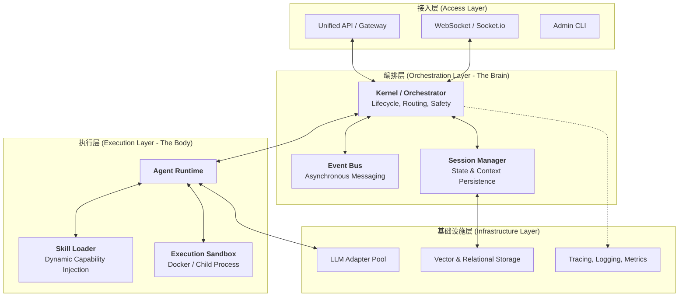

# 天命系统 (Mandate of Heaven) 宏观架构设计 v2.0

## 1. 设计目标 (Architecture Goals)

本项目旨在构建一个**通用型、工业级的多智能体协同平台 (Multi-Agent Orchestrator)**。
“官员”和“朝堂”仅作为其顶层的表现层插件（Skin），底层的核心架构必须具备：
- **高内聚低耦合**: 核心运行时与具体业务逻辑彻底分离。
- **标准化通信**: 智能体之间、智能体与外部系统之间采用统一协议。
- **弹性扩展**: 支持动态加载技能、工具和新的智能体角色。
- **可观测性**: 能够追踪每一个决策链条和资源消耗。

---

## 2. 宏观架构分层 (Macro Layered Architecture)



---

## 3. 核心支柱 (Core Pillars)

### 3.1 微内核 (Micro-Kernel / Kernel.js)
内核不包含任何具体的“业务指令”，它只负责：
- **资源分配**: 为每个 Agent 实例分配独立的上下文和权限。
- **消息路由**: 确保 A 发送的消息能准确送达 B 或 Frontend。
- **安全拦截**: 在 Agent 执行任何 Tool 之前进行权限校验和审计。

### 3.2 统一消息协议 (Unified Protocol)
借鉴 OpenClaw 的 ACP (Agent Control Protocol)，所有消息必须是结构化的：
```json
{
  "id": "msg_uuid",
  "from": "agent_id",
  "to": "target_id",
  "type": "ACTION | MESSAGE | SYSTEM",
  "payload": { ... },
  "metadata": { "token_usage": 100, "timestamp": 123456789 }
}
```

### 3.3 动态能力系统 (Skill System)
Agent 的能力（Tools）不再是写死在代码里的，而是通过 **Skills** 动态加载。
- **Skill 定义**: 包含 `metadata` (描述、输入输出定义) 和 `handler` (执行代码)。
- **隔离性**: 核心系统可以扫描 `skills/` 目录，按需加载，无需重启。

### 3.4 状态与记忆持久化 (State & Memory)
- **Session State**: 记录当前的会话状态、活跃 Agent、挂起的任务。
- **Agent Memory**: 长期记忆（向量存储）与短期记忆（会话历史）的混合管理。

---

## 4. 目录重构计划 (Macro to Micro)

我们将按照“先宏观，后微观”的顺序，将目录结构规范化：

```text
/
├── .env                    # 环境配置
├── config/                 # 核心系统配置
├── server/
│   ├── index.js            # 入口 (Bootloader)
│   ├── core/               # 宏观架构核心
│   │   ├── Kernel.js       # 内核控制器
│   │   ├── EventBus.js     # 全局消息总线
│   │   ├── Session.js      # 会话与状态管理
│   │   └── LLM.js          # 多模型适配器
│   ├── runtime/            # 运行时环境
│   │   ├── AgentRunner.js  # Agent 执行逻辑
│   │   ├── SkillManager.js # 技能加载与注入
│   │   └── Sandbox.js      # 安全隔离层
│   └── infra/              # 基础设施适配
│       ├── Storage.js      # 数据库适配器 (SQLite/JSONL)
│       └── Logger.js       # 结构化日志与追踪
├── agents/                 # 具体的智能体定义 (业务插件层)
├── skills/                 # 动态加载的技能包 (能力插件层)
└── data/                   # 持久化存储数据
```

---

## 5. 验证标准 (Success Criteria)

1.  **解耦验证**: 移除 `agents/` 下的所有文件，系统核心应能正常启动且不报错。
2.  **动态性验证**: 在系统运行过程中，向 `skills/` 添加一个新文件，系统能自动识别并赋予 Agent 新能力。
3.  **可追踪性**: 每一个 LLM 调用都能在 `infra/Logger` 中找到完整的 Input/Output 和 Token 消耗记录。

---

## 6. 下一步行动 (Action Plan)

1.  **Phase 1**: 创建 `server/core/` 目录，重构 `Kernel` 和 `EventBus` 为通用版本。
2.  **Phase 2**: 实现 `SkillManager`，支持从目录动态加载工具。
3.  **Phase 3**: 完善 `infra/Storage`，实现通用的 JSONL/SQLite 持久化方案。
4.  **Phase 4**: 最后将现有的“大明官员”逻辑作为插件移入 `agents/` 目录。
