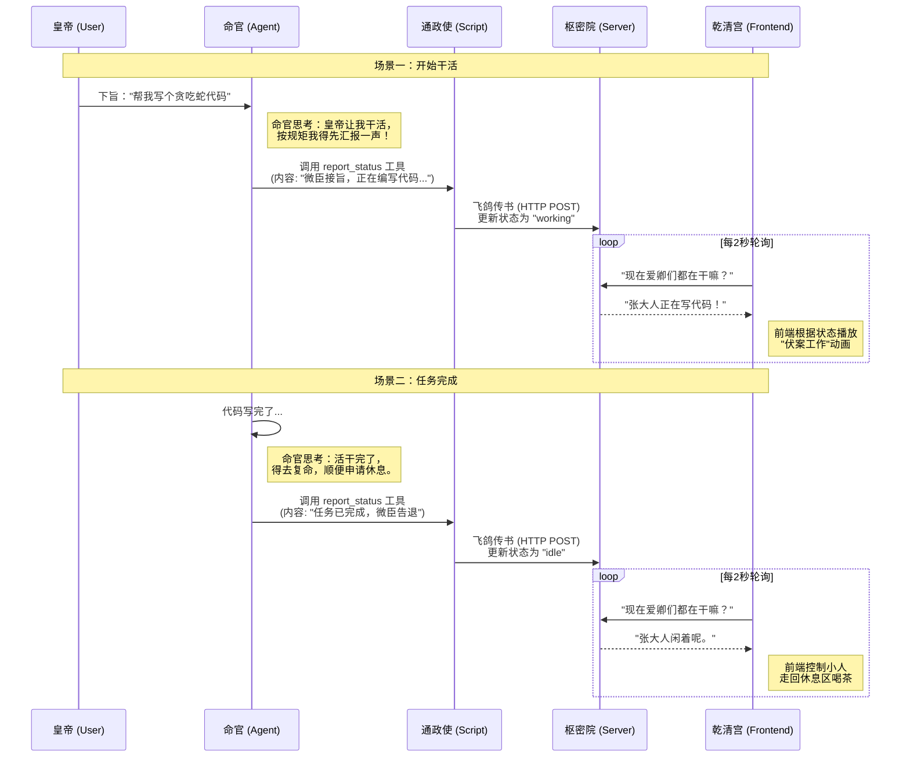

# 天命系统 - “上奏机制” 原理图解

我们可以把这套系统想象成一个**古代朝廷的运作流程**。

## 1. 角色对照表

| 角色 | 技术实体 | 职责 |
| :--- | :--- | :--- |
| **皇帝** | **User (你)** | 下达指令，查看结果 |
| **朝廷命官** | **OpenClaw Agent** | 执行任务的大模型 (LLM) |
| **通政使司** | **report_skill.js** | 负责跑腿送信的本地脚本 |
| **枢密院** | **Relay Server** | 存储百官状态的中转服务器 |
| **乾清宫沙盘** | **Frontend (React)** | 实时显示百官动态的可视化大屏 |

---

## 2. 运作流程 (时序图)

## 3. 核心逻辑解释

1.  **为什么 Agent 会主动汇报？**
    *   因为我们给它下了“死命令”（System Prompt），告诉它：**“只要干活，必须先调用 `report_status` 工具”**。对大模型来说，调用工具就像是发微信一样自然。

2.  **`report_skill.js` 起了什么作用？**
    *   它是连接 Agent 和 Server 的桥梁。Agent 只是个大脑，它想“汇报”，但它本身没有发 HTTP 请求的能力（或者配置起来很麻烦）。
    *   我们给它配了这个脚本，Agent 只需要喊一声“运行这个脚本”，脚本就会帮它把 HTTP 请求发出去。

3.  **前端是怎么知道状态变的？**
    *   前端其实不知道 Agent 什么时候变。它只是傻傻地每隔 2 秒问一次 Server（轮询）。
    *   一旦 Server 里的状态变了，下一次轮询时前端就知道了，然后立马更新动画。

---

**一句话总结：**
你让 Agent 养成“干活前先发个朋友圈”的习惯，而我们的系统就是那个每隔 2 秒刷新一次朋友圈的“吃瓜群众”。
