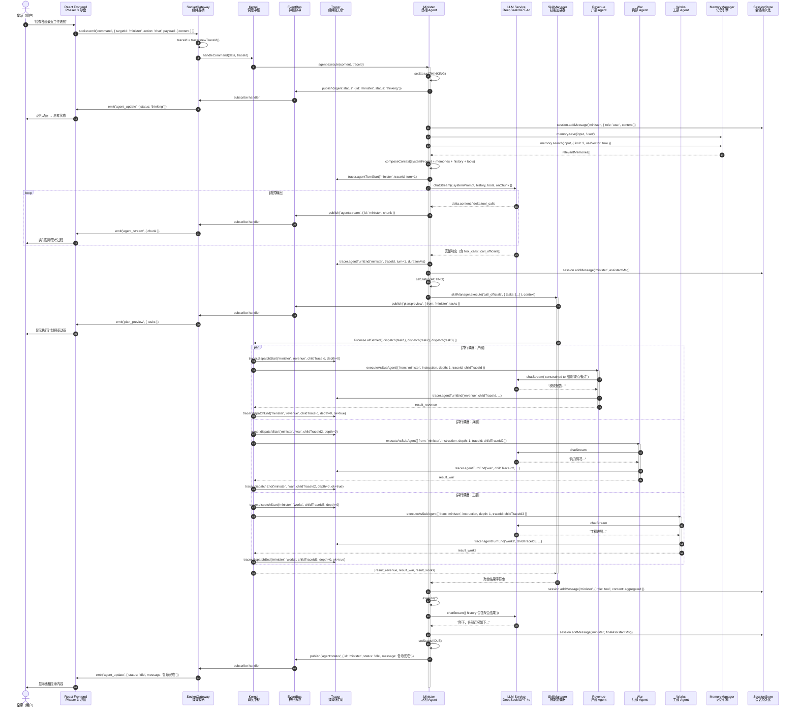

# Harness 架构白皮书：Syntropy 的缰绳哲学

> "Harness 不是束缚骏马的牢笼，而是让千里之力可被凡人驾驭的连接系统。"
>
> —— Syntropy (太和) 架构设计原则

---

## 目录

1. [Harness 的四个设计原则](#一harness-的四个设计原则)
2. [分层架构：三层缰绳体系](#二分层架构三层缰绳体系)
3. [数据流图：一次完整的"皇帝下旨"](#三数据流图一次完整的皇帝下旨)
4. [安全模型：信任边界的工程化构建](#四安全模型信任边界的工程化构建)
5. [可观测性模型：缰绳张力传感器](#五可观测性模型缰绳张力传感器)
6. [扩展性设计：编织新的缰绳](#六扩展性设计编织新的缰绳)
7. [技术选型的 Harness 视角](#七技术选型的-harness-视角)

---

## 一、Harness 的四个设计原则

在 Syntropy 的架构语境中，**Harness（缰绳）** 是一种隐喻，它代表人类与自主智能体之间可控、可感知、可撤销的连接。Harness 架构的每一条设计决策，都服务于一个核心目标：**让 AI 的自主性在人类的感知半径内运行**。

### 原则 1：连接优于单体（Connection over Monolith）

传统 AI 系统倾向于构建"超级单体"——一个无所不能的大模型或一个包揽一切的编排器。Harness 架构拒绝这种诱惑。我们相信，**真正的控制力来自于组件之间清晰的连接关系，而非单体的复杂度**。

在 Syntropy 中：
- Kernel 不持有 Socket.io 实例，传输层与调度层通过 `handleCommand()` 契约解耦
- Agent 不直接访问数据库，记忆操作通过 `MemoryManager` 接口隔离
- LLM 服务通过统一适配器封装，模型切换对上层透明

这种连接优先的设计，使得任何组件都可以被替换、升级或降级，而不会引发连锁崩塌。

### 原则 2：约束释放创造力（Constraints Unleash Creativity）

LLM 的创造力是无限的，但无约束的创造力等于混乱。Harness 架构通过**结构化约束**引导 LLM 的生成空间，使其在有限的自由度内产生更高质量的输出。

关键约束机制：
- **ACP 结构化调度协议**：`executeAsSubAgent({ from, instruction, depth })` 将自然语言指令压缩为结构化字段，消除信息二次损耗
- **官员响应契约**：Sub-Agent 输出被约束为 `结论 / 要点 / 备注` 三段式，抑制 LLM 的对话膨胀倾向
- **Token 预算与上下文修剪**：`ContextManager` 以"安全删除单元"策略保护 `tool_call` 配对完整性

这些约束不是对创造力的压制，而是**为创造力划定安全的跑道**。

### 原则 3：可观测才可信赖（Observability Enables Trust）

你无法信赖你看不见的东西。Harness 架构将可观测性内建于系统的每一根神经纤维，而非事后打补丁。

- **traceId 全链路传播**：从 SocketGateway 生成的根 traceId，到子 Agent 的派生 traceId（`parent.depth` 格式），贯穿每一次 dispatch、每一个 tool call、每一轮 LLM 对话
- **8 种结构化诊断事件**：`agent.turn.start/end`、`tool.call.start/end`、`model.usage`、`dispatch.start/end`、`approval.wait`、`agent.stuck`
- **流式遥测**：LLM 输出通过 SSE → Socket.io 实时推送至前端，用户的感知延迟趋近于零

可观测性不是监控仪表盘上的数字，而是**操作者手中可感知的缰绳张力**。

### 原则 4：记忆即身份（Memory is Identity）

一个 Agent 的身份不由它的 system prompt 定义，而由它**记住什么、如何回忆、如何遗忘**定义。Harness 架构将记忆视为 Agent 身份的核心构造。

- **三层记忆梯度**：工作记忆（In-Memory 上下文）→ 短期记忆（SQLite BM25）→ 长期记忆（SQLite + 向量索引）
- **LLM 主动记忆捕获**：`save_memory` 技能将记忆决策权交给 LLM 自身，零规则维护成本
- **RRF 混合检索**：BM25 的精确匹配与 BGE 向量语义检索通过倒数排名融合（`score = Σ 1/(k + rank_i)`）实现互补召回

Agent 不是无状态的函数调用，而是**在记忆中持续演化的数字生命体**。


---

## 二、分层架构：三层缰绳体系

Harness 架构将系统划分为三个正交平面，每个平面的职责边界如同缰绳的不同部位：控制层是执缰之手，执行层是驭马之力，持久层是征途之印。

```
┌─────────────────────────────────────────────────────────────────────────────┐
│                         用户（皇帝）—— 缰绳的持有者                            │
│                    浏览器 / React Frontend + Phaser 3                        │
└───────────────────────────┬─────────────────────────────────────────────────┘
                            │ WebSocket (Socket.io)
                            │ 事件：command / agent_update / agent_stream /
                            │       plan_preview / approval_request
                            ▼
┌─────────────────────────────────────────────────────────────────────────────┐
│                      SocketGateway —— 缰绳的握柄                               │
│     连接生命周期 │ 入站归一化 + traceId 生成 │ 出站事件广播                       │
└───────────────────────────┬─────────────────────────────────────────────────┘
                            │ handleCommand(data, traceId)
                            ▼
┌─────────────────────────────────────────────────────────────────────────────┐
│  ╔═══════════════════════════════════════════════════════════════════════╗   │
│  ║                    控制层（Control Plane）—— 执缰之手                  ║   │
│  ║                                                                       ║   │
│  ║   ┌──────────────┐   ┌──────────────┐   ┌────────────────────────┐   ║   │
│  ║   │   Kernel     │   │  EventBus    │   │       Tracer           │   ║   │
│  ║   │  Agent 注册   │   │  内部 Pub/Sub │   │  traceId / 诊断事件 /    │   ║   │
│  ║   │ 消息路由调度  │   │  解耦组件     │   │ 日志脱敏 / 卡死检测      │   ║   │
│  ║   │ ACP dispatch │   │              │   │                        │   ║   │
│  ║   └──────────────┘   └──────────────┘   └────────────────────────┘   ║   │
│  ╚═══════════════════════════════════════════════════════════════════════╝   │
│                                    │                                        │
│                                    ▼                                        │
│  ╔═══════════════════════════════════════════════════════════════════════╗   │
│  ║                    执行层（Execution Plane）—— 驭马之力                ║   │
│  ║                                                                       ║   │
│  ║   ┌──────────────┐   ┌──────────────┐   ┌────────────────────────┐   ║   │
│  ║   │    Agent     │   │ SkillManager │   │     LLM Service        │   ║   │
│  ║   │ 状态机驱动    │   │ 动态技能加载  │   │  DeepSeek / GPT-4o     │   ║   │
│  ║   │ 工具调用执行  │   │ 权限检查执行  │   │  流式输出 / Token 计量  │   ║   │
│  ║   │ 记忆读写      │   │ 风险分级标注  │   │  模型降级容错          │   ║   │
│  ║   └──────────────┘   └──────────────┘   └────────────────────────┘   ║   │
│  ╚═══════════════════════════════════════════════════════════════════════╝   │
│                                    │                                        │
│                                    ▼                                        │
│  ╔═══════════════════════════════════════════════════════════════════════╗   │
│  ║                    持久层（Persistence Plane）—— 征途之印              ║   │
│  ║                                                                       ║   │
│  ║   ┌──────────────────────────┐   ┌────────────────────────────────┐   ║   │
│  ║   │     MemoryManager          │   │         SessionStore           │   ║   │
│  ║   │  SQLite + FTS5 + 向量索引   │   │   SQLite (better-sqlite3)      │   ║   │
│  ║   │  RRF 混合检索              │   │   按 agent_id 隔离 / 原子清空    │   ║   │
│  ║   │  自动去重 / 嵌入生成        │   │   预编译语句 / 索引优化          │   ║   │
│  ║   └──────────────────────────┘   └────────────────────────────────┘   ║   │
│  ╚═══════════════════════════════════════════════════════════════════════╝   │
└─────────────────────────────────────────────────────────────────────────────┘
```

### 2.1 控制层（Control Plane）—— 执缰之手

控制层是 Harness 的神经系统，它不执行具体任务，而是**决定谁执行、何时执行、执行结果流向何方**。

#### Kernel —— 调度中枢

`Kernel` 是控制层的核心，其职责被严格限定为：

- **Agent 生命周期管理**：`registerAgent()` / `unregisterAgent()`，注入 kernel 引用，触发 `onWake()` 钩子
- **命令路由**：`handleCommand({ targetId, action, payload }, traceId)` 统一处理所有入站指令，包括 `chat`、`approve`、`reject`
- **ACP 结构化调度**：`dispatch(message, depth)` 实现 Agent 间通信，携带 `MAX_SPAWN_DEPTH=2` 的防递归保护

Kernel 的关键设计：**零传输层依赖**。它不持有 `io` 实例，只通过 `EventBus` 发布事件。这种设计使得 Kernel 可以被独立单元测试，也可以在非 Socket.io 环境（如 CLI、Cron 任务）中复用。

```javascript
// Kernel.dispatch 的核心逻辑
async dispatch(message, depth = 0, traceId = null) {
    const MAX_SPAWN_DEPTH = 2;
    if (depth >= MAX_SPAWN_DEPTH) {
        return '[系统] 派生深度超限，拒绝执行';
    }
    // Promise.race + 60s timeout 防止单个 Agent 卡死导致调度器永久挂起
    const timeout = new Promise((_, reject) =>
        setTimeout(() => reject(new Error(`dispatch timeout`)), 60000)
    );
    const result = await Promise.race([
        targetAgent.executeAsSubAgent({ from, instruction, depth: depth + 1, traceId }),
        timeout
    ]);
    return result;
}
```

#### EventBus —— 神经脉冲

基于 Node.js `EventEmitter` 的内部 Pub/Sub 系统，最大监听器数扩展至 100。它承载所有组件间异步通信：

| 事件名 | 发布者 | 订阅者 | 语义 |
|--------|--------|--------|------|
| `agent:status` | Agent | SocketGateway | 状态变更广播 |
| `agent:stream` | LLM | SocketGateway | 流式输出分片 |
| `approval:request` | Agent | SocketGateway | 高风险操作审批请求 |
| `plan:preview` | call_officials skill | SocketGateway | 并行执行计划预览 |
| `decision:made` | Agent / Skill | SocketGateway | 决策追踪事件 |

EventBus 不保证消息持久化，只保证**低延迟分发**。需要持久化的消息由 SessionStore 和 MemoryManager 兜底。

#### Tracer —— 缰绳张力计

`Tracer` 是 Harness 可观测性的核心基础设施，以单例模式贯穿全系统：

- **traceId 生成与派生**：根 traceId 为 8 位 hex 随机串，子 Agent 继承为 `parent.depth` 格式，形成树状链路
- **结构化诊断事件**：10 类事件覆盖 Agent 全生命周期，输出格式为 `[TRACE] {event, ts, ...}` 的 NDJSON 流
- **日志脱敏层**：基于正则的实时脱敏，覆盖 Bearer Token、`sk-*` 密钥、password/secret/api_key 等模式
- **卡死检测**：每 60s 扫描 `_activeAgents` 映射，超过 `STUCK_THRESHOLD_MS=3min` 自动触发 `agent.stuck` 告警

```javascript
// 脱敏示例
// 输入: "Bearer sk-abcdefghijklmnopqrstuvwxyz"
// 输出: "Bearer sk-abcd…[redacted]"
// 输入: "api_key: "super_secret_key_12345""
// 输出: "api_key: "super_…_2345""
```


### 2.2 执行层（Execution Plane）—— 驭马之力

执行层是 Harness 的肌肉系统，负责将控制层的决策转化为实际的 LLM 调用、工具执行和记忆操作。

#### Agent —— 状态机驱动的执行体

每个 Agent 是一个独立的状态机，其生命周期严格遵循：

```
INITIALIZING ──onWake()──▶ IDLE ──execute()──▶ THINKING ──LLM 返回 tool_calls──▶ ACTING
    ▲                         │                      │                              │
    │                         │                      │                              │
    │                         └──onSleep()──▶ SLEEPING                             │
    │                                                                              │
    │                                    ◀────────── 无 tool_calls ────────────────┘
    │                                                                              │
    │                                    ◀────────── 用户 approve ─────────────────┘
    │                                        (WAITING_FOR_HUMAN 状态)              │
    │                                                                              │
    └──────────────────── 任务完成 / onError() ──────────────────────────────────────┘
```

Agent 的核心执行循环 `execute(input, traceId)` 实现了以下机制：

1. **上下文组装**：`ContextManager.composeContext()` 合并 system prompt、历史对话、相关记忆、工具定义
2. **记忆注入**：首轮对话自动检索 Top-3 相关记忆，以 `Relevant Context` 形式追加到 system prompt
3. **流式 LLM 调用**：`kernel.llm.chatStream()` 支持逐 token 回调，实时推送至前端
4. **工具调用处理**：`handleToolCalls()` 遍历 tool_calls，执行权限检查、风险分级、审批流拦截
5. **回合限制**：`maxTurns=5` 防止无限循环，到达上限后强制收敛

#### SkillManager —— 动态技能加载器

SkillManager 在启动时扫描 `skills/` 目录，动态加载所有 `.js`/`.mjs` 文件。每个技能被转换为 OpenAI Function Calling 格式，并标注风险等级：

```javascript
{
    definition: { type: 'function', function: { name, description, parameters } },
    handler: async (args, context) => { ... },
    riskLevel: 'low' | 'medium' | 'high'
}
```

技能的执行上下文 `context` 包含：
- `agent`：当前 Agent 实例（用于访问 memory、workspace）
- `kernel`：Kernel 实例（用于 dispatch、事件发布）
- `workspace`：Agent 私有工作目录
- `depth`：当前派生深度
- `traceId`：链路追踪 ID

这种上下文注入机制使得技能可以调用其他 Agent（`kernel.dispatch`）、读写记忆（`agent.memory.save`）、访问系统级资源，同时保持类型安全和权限隔离。

#### LLM Service —— 统一适配器

`LLM` 类封装了 OpenAI 兼容 API（OpenAI、DeepSeek、Azure 等），提供两种调用模式：

- **`chat()`**：标准阻塞调用，适用于后台任务
- **`chatStream()`**：流式调用，逐 chunk 回调，适用于前端实时展示

流式调用的技术细节：
- 使用 `stream_options: { include_usage: true }` 获取最终 token 用量
- 在流中实时累积 `tool_calls` 的分片数据（`delta.tool_calls[].function.name/arguments`）
- 流结束后自动触发 `tracer.modelUsage()`，记录 promptTokens、completionTokens、durationMs

### 2.3 持久层（Persistence Plane）—— 征途之印

持久层是 Harness 的记忆宫殿，负责将瞬时的计算状态转化为可检索、可复用的长期资产。

#### MemoryManager —— 混合记忆引擎

每个 Agent 拥有独立的 SQLite 数据库（`data/agents/<agent_id>.db`），包含：

- **`chunks` 表**：存储所有消息片段、记忆条目、知识片段，含 `content`、`role`、`metadata`、`embedding`、`created_at`
- **`chunks_fts` 虚拟表**：FTS5 全文索引，通过触发器与 `chunks` 表实时同步
- **向量存储**：`embedding` 列为 BLOB 类型，存储 Float32Array 缓冲区

**RRF 混合检索算法**：

```
给定查询 Query "去年税收情况"

FTS5 检索 ──▶ 结果集 A (rank_a = 1, 2, 3...)
向量检索 ──▶ 结果集 B (rank_b = 1, 2, 3...)

对于每个文档 d：
    score_RRF(d) = Σ 1 / (k + rank_i)
    其中 k = 60（平滑常数）

最终按 score_RRF 降序排列，取 Top-K
```

该算法的优势在于：**无需调参权重**，BM25 和向量检索的结果通过排名而非绝对分数融合，天然适应不同量纲的相似度度量。

**自动去重机制**：`save()` 方法在写入前检查最近 5 条同 role 记录，若内容完全一致则跳过写入，避免 LLM 重复调用导致的记忆膨胀。

#### SessionStore —— 会话持久化

使用 `better-sqlite3` 的同步 API 实现高性能会话存储：

```sql
CREATE TABLE messages (
    id INTEGER PRIMARY KEY AUTOINCREMENT,
    agent_id TEXT NOT NULL,
    role TEXT NOT NULL,
    content TEXT,
    tool_calls TEXT,        -- JSON 序列化的 tool_calls 数组
    tool_call_id TEXT,      -- tool role 时的关联 ID
    name TEXT,
    created_at INTEGER NOT NULL
);
CREATE INDEX idx_agent_created ON messages(agent_id, created_at);
```

SessionStore 的设计取舍：
- **同步 API**：`better-sqlite3` 的 `prepare().run()` / `all()` 是同步的，避免了 async/await 在热点路径上的开销
- **预编译语句**：`saveMessage`、`loadMessages`、`clearMessages` 均在构造时预编译，重复执行时零解析开销
- **50 条限制**：`Session.loadMessages()` 只加载最近 50 条，`ContextManager.pruneContext()` 在此基础上进一步按 token 预算修剪


---

## 三、数据流图：一次完整的"皇帝下旨"

以下是一次典型多 Agent 协作请求的完整数据流——用户询问"检查各部最近工作进展"，丞相（Minister）识别需要多部门协同，触发并行调度。



### 关键数据流特征

1. **traceId 全链路传播**：根 traceId 在 SocketGateway 生成，经 Kernel → Minister → dispatch → 各 Sub-Agent，形成 `a1b2c3d4 → a1b2c3d4.0 → a1b2c3d4.0.1` 的派生树
2. **流式感知**：LLM 的每一个 token 都通过 EventBus → SocketGateway → Frontend 实时推送，用户的感知延迟 < 100ms
3. **并行聚合**：`Promise.allSettled` 保证单个部门失败不阻塞其他部门，最终由丞相汇总
4. **状态机可视化**：每一次 `setStatus()` 都会触发 `agent_update` 事件，前端 Phaser 3 沙盘实时同步 Agent 动画状态


---

## 四、安全模型：信任边界的工程化构建

Harness 架构的安全模型不是事后打补丁，而是从设计之初就内建的**多层防御体系**。我们将安全风险视为缰绳上的张力突变——系统必须能够感知、拦截、并请求人工介入。

### 4.1 风险分级与审批流

每个技能在注册时标注 `riskLevel`：

| 风险等级 | 示例技能 | 行为 |
|----------|----------|------|
| **low** | `search_knowledge`, `memory_search` | 自动执行，无中断 |
| **medium** | `call_official`, `spawn_agent` | 暂停执行，弹出审批请求 |
| **high** | `execute_code`, `delete_memory`, `send_email` | 暂停执行，弹出审批请求 + 高亮警告 |

审批流的实现机制：

```javascript
// Agent.handleToolCalls() 中的风险检查
const skill = this.kernel.skillManager.getSkill(functionName);
if (skill && (skill.riskLevel === 'medium' || skill.riskLevel === 'high')) {
    this.setStatus(AgentState.WAITING_FOR_HUMAN);
    tracer.approvalWait(this.id, activeTraceId, functionName);

    this.kernel.events.publish('approval:request', {
        agentId: this.id,
        toolCallId: toolCall.id,
        functionName,
        args,
        riskLevel: skill.riskLevel
    });

    // 保存待审批状态，暂停当前执行流
    this.pendingApproval = { toolCall, toolCallsRemaining };
    return; // 关键：return 阻止后续 tool 执行
}
```

审批结果的处理：
- **批准**：`resumeFromApproval(true)` → 执行被拦截的 tool → 继续剩余 tools → 重新触发 `execute('')` 让 LLM 基于结果继续
- **拒绝**：`resumeFromApproval(false, feedback)` → 向 LLM 注入 `User rejected execution. Feedback: ...` → LLM 自主决定后续策略（道歉、换方案、终止）

这种设计保持了**任务连续性**：审批不是流程的中断点，而是执行流中的一个特殊分支。

### 4.2 派生深度控制（防递归爆炸）

```javascript
// Kernel.dispatch() 中的深度检查
async dispatch(message, depth = 0, traceId = null) {
    const MAX_SPAWN_DEPTH = 2;
    if (depth >= MAX_SPAWN_DEPTH) {
        return '[系统] 派生深度超限，拒绝执行';
    }
    // ...
    return await targetAgent.executeAsSubAgent({
        from, instruction,
        depth: depth + 1,  // 自动累加
        traceId
    });
}
```

`depth` 通过 skill execution context 透传：`context.depth`。当丞相调用 `call_officials` 时，depth=0；当户部被 dispatch 时，depth=1；如果户部再 spawn 子 Agent，depth=2，达到上限，任何进一步派生都会被直接拒绝。

### 4.3 超时保护（防挂起）

每次 `dispatch()` 被 `Promise.race` 包装：

```javascript
const TIMEOUT_MS = 60000;
const timeout = new Promise((_, reject) =>
    setTimeout(() => reject(new Error(`dispatch timeout after ${TIMEOUT_MS}ms`)), TIMEOUT_MS)
);
const result = await Promise.race([subAgentPromise, timeout]);
```

这意味着：即使某个 Agent 因 LLM API 故障、网络中断或逻辑死锁而永久挂起，调度器也会在 60 秒后抛出异常，不会阻塞整个系统。

### 4.4 日志脱敏（防密钥泄露）

Tracer 的 `redact()` 函数在**序列化输出之前**拦截敏感信息：

```javascript
const REDACT_PATTERNS = [
    // Bearer Token: "Bearer eyJhbG..." → "Bearer eyJhbG…[redacted]"
    { re: /(Bearer\s+)([A-Za-z0-9\-._~+/]{8,})/gi, replace: (_, p, v) => p + redactValue(v) },
    // OpenAI/DeepSeek 密钥: "sk-abcd1234..." → "sk-abcd…[redacted]"
    { re: /(sk-[A-Za-z0-9]{4})[A-Za-z0-9\-]*/g, replace: (_, p) => p + '…[redacted]' },
    // 键值对密码: "api_key: \"secret\"" → "api_key: \"secr…\""
    { re: /("?(?:password|secret|api_?key|token)"?\s*[:=]\s*")([^"]{4,})(")/gi,
      replace: (_, k, v, q) => k + redactValue(v) + q },
];
```

脱敏策略：
- 长度 ≤ 8 的字段替换为 `***`
- 长度 > 8 的字段保留前 6 位 + `…` + 后 4 位，既防止泄露又保留调试辨识度

### 4.5 卡死检测（最终兜底）

Tracer 内部维护 `_activeAgents: Map<agentId, { traceId, since, turn }>`，每 60 秒扫描一次：

```javascript
_checkStuck() {
    const now = Date.now();
    for (const [agentId, { traceId, since, turn }] of this._activeAgents) {
        if (now - since > this.STUCK_THRESHOLD_MS) { // 3 分钟
            this.emit('agent.stuck', { agentId, traceId, turn, elapsedMs });
        }
    }
}
```

当 Agent 进入 `THINKING` 状态时记录时间戳，离开状态时删除。如果 3 分钟后仍在该状态，触发告警。这是最后一道防线，覆盖所有未预料到的阻塞场景。


---

## 五、可观测性模型：缰绳张力传感器

在 Harness 架构中，可观测性不是监控系统的附属品，而是**操作者与 Agent 之间的感知通道**。我们将 Tracer 比作"缰绳张力传感器"——骑手不需要看到马匹的每一块肌肉，只需要感受缰绳的张力变化，就能判断马匹的状态。

### 5.1 全链路 traceId 传播

```
根 traceId (SocketGateway 生成)
    │
    ├──▶ Minister.execute(input, "a1b2c3d4")
    │       └── tool_call: call_officials
    │
    ├──▶ dispatch("a1b2c3d4", depth=0)
    │       ├──▶ Revenue.executeAsSubAgent(traceId="a1b2c3d4.0", depth=1)
    │       │       └── agent.turn.end
    │       │
    │       ├──▶ War.executeAsSubAgent(traceId="a1b2c3d4.1", depth=1)
    │       │       └── agent.turn.end
    │       │
    │       └──▶ Works.executeAsSubAgent(traceId="a1b2c3d4.2", depth=1)
    │               └── agent.turn.end
    │
    └──▶ Minister 聚合结果，agent.turn.end
```

通过 traceId 的派生树，任何一次复杂调度的全链路都可以被精确重建。

### 5.2 结构化诊断事件体系

| 事件类型 | 触发时机 | 关键字段 | 用途 |
|----------|----------|----------|------|
| `agent.turn.start` | Agent 开始一轮思考 | `agentId`, `traceId`, `turn` | 标记思考开始，启动卡死检测计时器 |
| `agent.turn.end` | Agent 完成一轮思考 | `agentId`, `traceId`, `turn`, `durationMs` | 计算单轮延迟，释放卡死检测 |
| `tool.call.start` | 工具执行开始前 | `agentId`, `traceId`, `toolName`, `callId` | 追踪工具调用分布 |
| `tool.call.end` | 工具执行完成后 | `agentId`, `traceId`, `toolName`, `durationMs`, `ok` | 计算工具成功率、延迟 |
| `model.usage` | LLM 流式输出结束后 | `agentId`, `traceId`, `model`, `promptTokens`, `completionTokens` | Token 成本核算、模型效率分析 |
| `dispatch.start` | 子 Agent 调度前 | `from`, `to`, `traceId`, `depth` | 追踪调用拓扑 |
| `dispatch.end` | 子 Agent 调度后 | `from`, `to`, `traceId`, `depth`, `durationMs`, `ok` | 计算子 Agent 延迟、成功率 |
| `approval.wait` | 进入人工审批 | `agentId`, `traceId`, `toolName` | 追踪人机协同频率 |
| `agent.stuck` | 卡死检测触发 | `agentId`, `traceId`, `turn`, `elapsedMs` | 系统健康告警 |

### 5.3 流式感知：操作者的实时触觉

传统系统的可观测性是"事后查询日志"，Harness 的可观测性是**实时触觉反馈**：

```
LLM.chatStream()
    → onChunk(delta.content)
    → EventBus.publish('agent:stream', { id, chunk })
    → SocketGateway.emit('agent_stream')
    → Frontend MessageProcessor 拼接 chunk
    → React 状态更新 → DOM 渲染
```

从 LLM 生成一个 token 到用户在屏幕上看到它，端到端延迟通常在 50-200ms 之间。这种流式反馈让用户**感知到 Agent 正在思考**，而不是面对一个黑盒等待。

### 5.4 决策追踪（Decision Trace）

除了技术层面的遥测，Harness 还引入了**业务层面的决策追踪**：

- **`decision:made`**：记录 Agent 做出的每一次路由决策——为什么选择户部而不是兵部？置信度是多少？备选方案是什么？
- **`decision:output`**：记录决策的最终输出——实际返回了什么？耗时多久？

这些事件可以被前端可视化为一棵**决策树**，让用户不仅看到"结果是什么"，还能看到"为什么是这个结果"。

### 5.5 前端状态同步：Phaser 3 沙盘的 Harness 映射

前端使用 Phaser 3 游戏引擎渲染 2D 像素沙盘，每个 Agent 是一个可交互的 NPC 角色。`agent_update` 事件驱动状态机动画：

| Agent 状态 | Phaser 3 动画 | 语义 |
|------------|---------------|------|
| `idle` | 站立呼吸动画 | 待命 |
| `thinking` | 思考气泡 + 轻微摇头 | 正在处理 |
| `acting` | 行走至目标位置 + 执行动作 | 正在执行工具 |
| `waiting_for_human` | 跪拜动画 + 感叹号 | 等待御批 |
| `error` | 摔倒 + 灰色滤镜 | 执行出错 |

这种可视化将抽象的 Agent 状态转化为人类直觉可理解的叙事场景，是 Harness "可感知连接"哲学的终极体现。


---

## 六、扩展性设计：编织新的缰绳

Harness 架构的扩展性遵循"约定优于配置"原则，添加新组件的成本被压缩到最小。

### 6.1 添加新 Agent

```javascript
// 1. 定义 Agent 配置
const newAgentConfig = {
    id: 'official_customs',           // 唯一标识
    name: '海关大臣',
    identity: { name: '海关大臣', emoji: '⚓', avatar: null },
    systemPrompt: '你是海关大臣，负责管理进出口贸易...',
    model: { primary: 'deepseek-chat', fallbacks: ['gpt-4o-mini'] },
    skills: ['search_knowledge', 'save_memory'],  // 允许的技能白名单
    tools: [],
    maxTurns: 5,
    tokenLimit: 4096
};

// 2. 实例化并注册
import { Agent } from './server/core/Agent.js';
const agent = new Agent(newAgentConfig);
kernel.registerAgent(agent);

// 3. 前端同步更新配置（如需在沙盘中显示）
// 在 agents_config.json 中添加角色定义
```

Agent 注册后自动加入 Kernel 的调度体系，可被 `call_officials` 技能直接调用（需在技能的 `enum` 列表中添加 `official_customs`）。

### 6.2 添加新技能

创建 `skills/my_new_skill.js`：

```javascript
export default {
    name: 'my_new_skill',
    description: '一句话描述技能用途，LLM 据此判断是否调用',
    parameters: {
        type: 'object',
        properties: {
            param1: { type: 'string', description: '参数说明' }
        },
        required: ['param1']
    },
    riskLevel: 'low', // 'low' | 'medium' | 'high'
    handler: async ({ param1 }, { agent, kernel, workspace, depth, traceId }) => {
        // 业务逻辑
        // 可以调用 agent.memory.save() 写入记忆
        // 可以调用 kernel.dispatch() 调度其他 Agent
        // 可以读写 workspace 目录下的文件
        return { result: 'success', data: ... };
    }
};
```

SkillManager 在启动时自动扫描 `skills/` 目录，无需修改任何现有代码。新技能即刻对所有 Agent 可用（受 `skillsFilter` 白名单约束）。

### 6.3 添加新工具（LLM Function Calling 格式）

工具是技能的同义词，但在 Agent 配置层面可以直接注入：

```javascript
const agentConfig = {
    // ...
    tools: [
        {
            type: 'function',
            function: {
                name: 'custom_tool',
                description: '...',
                parameters: { type: 'object', properties: { ... } }
            }
        }
    ]
};
```

注意：直接注入的 `tools` 需要在 SkillManager 中注册同名 handler，否则 Agent 会收到 `Tool not found` 错误。推荐统一通过 `skills/` 目录管理。

### 6.4 添加新 LLM 提供商

修改 `server/core/LLM.js`：

```javascript
// LLM 类使用 OpenAI 兼容 SDK，因此任何提供 OpenAI-compatible API 的服务
// （DeepSeek、Moonshot、Groq、Azure OpenAI、本地 vLLM）均可直接接入

const client = new OpenAI({
    apiKey: process.env.OPENAI_API_KEY,
    baseURL: process.env.OPENAI_BASE_URL  // 切换此处即可更换提供商
});
```

对于非 OpenAI 兼容的 API，可以：
1. 继承 `LLM` 类，重写 `chat()` 和 `chatStream()` 方法
2. 在 `Agent.modelConfig` 中指定自定义模型标识
3. Kernel 在初始化时根据模型标识路由到对应的 LLM 实例

### 6.5 添加新记忆检索策略

`MemoryManager.search()` 是插件化的：

```javascript
async search(query, options = { limit: 5, useVector: true, filterRole: null, debug: false }) {
    const ftsResults = this.searchFTS(query, limit * 2, filterRole);
    let vectorResults = [];
    if (useVector && this.embeddingService) {
        const queryVector = await this.embeddingService.embed(query);
        vectorResults = this.searchVector(queryVector, limit * 2, filterRole);
    }
    // 在此处插入新的检索策略
    // const graphResults = this.searchKnowledgeGraph(query, limit * 2);
    return this.rankRRF(ftsResults, vectorResults, limit, 60, debug);
}
```

新增检索源后，只需在 `rankRRF()` 中添加对应的分数累加逻辑即可参与融合排序。


---

## 七、技术选型的 Harness 视角

### 为什么不用 LangGraph / AutoGen？

| 维度 | LangGraph | AutoGen | Harness (Syntropy) |
|------|-----------|---------|-------------------|
| **调度自由度** | 受 DAG 约束，动态分支困难 | Agent 通信模式固定 | 完全自定义 ACP 协议，结构化零损耗传递 |
| **状态机** | 无内置 | 无内置 | 7 状态严格生命周期，可视化驱动 |
| **人机协同** | 需自行实现 | 需自行实现 | 内建风险分级 + 审批流 + 任务连续性保持 |
| **记忆系统** | 依赖外部向量库 | 无内置 | 内置 SQLite + FTS5 + 向量 + RRF 融合 |
| **可观测性** | 基础日志 | 基础日志 | traceId 全链路 + 10 类诊断事件 + 卡死检测 |
| **前端集成** | 无 UI 层 | 无 UI 层 | React + Phaser 3 + Socket.io 实时同步 |
| **并发模型** | Python GIL 限制 | 多进程复杂 | Node.js 事件循环天然非阻塞并发 |
| **部署复杂度** | 需 Python 环境 + 外部依赖 | 需 Python 环境 | 单 Node.js 进程，SQLite 零运维 |

### 为什么选 Node.js + Socket.io？

- **事件驱动与 Agent 并发天然匹配**：`Promise.allSettled` 让 N 个 Agent 并行执行成为一行代码
- **全栈 TypeScript**：前后端类型共享，减少接口契约错误
- **Socket.io 的 room 机制**：`io.to('frontend').emit()` 实现精准的广播控制
- **轻量部署**：单进程 + SQLite，无需 Docker、无需向量数据库、无需 Redis

### 为什么选 SQLite 而非专用向量数据库？

Harness 架构追求**极简部署与零运维**。SQLite 的优势：

- **单文件**：`data/agents/<agent_id>.db`，备份即复制文件
- **FTS5 全文索引**：内置，无需 Elasticsearch
- **better-sqlite3 同步 API**：热点路径零 async/await 开销
- **预编译语句**：重复查询零解析开销
- **BLOB 向量存储**：MVP 阶段完全够用，生产环境可无缝迁移到 `sqlite-vss`

当数据量增长到 SQLite 单文件上限（约 281TB 理论值，实际 10GB+ 时）或并发写入成为瓶颈时，可以：
1. 引入 `sqlite-vss` 替代暴力向量搜索
2. 将 SessionStore 迁移到 PostgreSQL
3. 将 MemoryManager 的向量索引迁移到 Milvus/Pinecone

这些迁移都不会触及业务代码，因为 `MemoryManager` 和 `SessionStore` 的接口是稳定的。

### 为什么选 DeepSeek 作为主模型？

- **成本**：API 价格约为 GPT-4o 的 1/20，适合高频 Agent 交互场景
- **中文能力**：对古风语境、文言词汇的理解显著优于西方模型
- **工具调用**：完整支持 OpenAI Function Calling 格式，零适配成本
- **fallback 机制**：`modelConfig.fallbacks` 数组允许在主模型故障时自动降级到 GPT-4o-mini 等备选模型

---

## 结语：Harness 作为架构哲学

Syntropy 的 Harness 架构不仅仅是一套技术组件的堆砌，它是一种**关于人类与 AI 如何共处的架构哲学**。

- **连接优于单体**：我们拒绝将智能压缩为黑盒，而是通过清晰的接口和协议，让每一匹骏马（Agent）都在骑手（用户）的感知范围内奔跑。
- **约束释放创造力**：我们通过结构化协议和状态机约束，引导 LLM 的无限创造力在安全的跑道上驰骋。
- **可观测才可信赖**：我们将可观测性内建于每一根神经纤维，让操作者通过缰绳的张力感知系统的每一次心跳。
- **记忆即身份**：我们不创造无状态的工具，我们培育在记忆中持续演化、在交互中逐步成长的数字生命。

Harness 不是对 AI 的束缚，而是**让自主性成为可信赖之物的工程艺术**。

---

> **文档元数据**
> - 版本：v1.0
> - 日期：2026-04-19
> - 作者：Syntropy 架构组
> - 关联文档：`docs/ARCHITECTURE.md`（技术实现视角）、`核心理念.md`（产品叙事视角）
